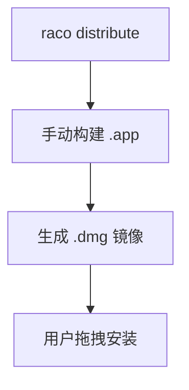

# Racket 开发者必看：如何将应用打包成 Windows macOS Linux 安装包

> `raco exe` 给你一个可执行文件，但普通用户要的是双击安装的体验——这篇拆解从可执行文件到 Windows、macOS、Linux 原生安装包的跨平台分发全流程。

Racket 开发者常陷入的困境：用 `raco` 生成可执行文件后，如何让普通用户像安装常规软件一样轻松使用？本文将拆解跨平台分发的关键环节，揭示语言工具与操作系统生态的边界。

## 一、理解 Racket 分发流程的边界

完整的应用分发链路包含两个责任域：

```text
Racket 源码 → raco exe → 可执行文件 → raco distribute → 可分发目录 → 平台安装器 → 用户安装
```

**关键分界点**：

- **Racket 责任**：构建自包含的可运行环境
- **操作系统责任**：提供安装/卸载体验

## 二、为什么 Racket 不提供安装器功能？

### 1. 安装器的平台特性

安装过程涉及：
- 系统目录操作（Windows 注册表 /macOS 应用包）
- 快捷方式创建
- 卸载程序集成
- 数字签名验证

这些都属于 **操作系统原生规范**，与编程语言无关。

### 2. Racket 的明智选择

`raco distribute` 生成标准的 **可移植目录**，包含：
- 独立运行的二进制
- 依赖的库文件
- 资源文件

这种设计让开发者可以自由选择：
- Windows：Inno Setup/NSIS
- macOS：.app Bundle + dmg
- Linux：tar.gz/AppImage

## 三、Windows 分发实战指南

### 1. 用户预期管理

Windows 用户期待：
- 标准的 setup.exe 安装向导
- 开始菜单快捷方式
- 控制面板可卸载

### 2. 推荐工具链

使用 **Inno Setup** 的优势：
- 免费开源且稳定
- 对目录型应用支持完善
- 脚本配置简单

### 3. 最小可行方案

典型工作流：
```bash
raco exe main.rkt
raco distribute dist myapp
```
然后配置 Inno Setup 脚本：
```iss
[Setup]
AppName=MyApp
DefaultDirName={pf}\MyApp

[Files]
Source: "dist\*"; DestDir: "{app}"; Flags: recursesubdirs

[Icons]
Name: "{group}\MyApp"; Filename: "{app}\myapp.exe"
```

## 四、macOS 分发核心要点

### 1. 理解 .app 本质

macOS 的 .app 是特殊目录结构：
```text
MyApp.app/
└─ Contents/
 ├─ MacOS/ # 存放 raco distribute 输出
 ├─ Resources/
 └─ Info.plist # 应用元数据
```

### 2. 分发流程



### 3. 实用工具推荐

- `create-dmg`：快速生成磁盘镜像
- `codesign`：基础代码签名
- `gon`：简化公证流程

## 五、Linux 分发策略

### 1. 适应 Linux 哲学

推荐简单方案：
```bash
tar czvf myapp-linux.tar.gz dist/
```
用户只需：
```bash
tar xzvf myapp-linux.tar.gz
./dist/myapp
```

### 2. 进阶选择

- **AppImage**：单文件分发
- **deb/rpm**：需要学习打包规范
- **Flatpak**：沙箱化部署

## 六、跨平台分发路线图

| 平台 | 工具链 | 输出格式 | 用户体验 |
|------|--------|----------|----------|
| Windows | Inno Setup | setup.exe | 向导安装 |
| macOS | app+dmg | .dmg | 拖拽安装 |
| Linux | tar.gz | .tar.gz | 解压即用 |

## 七、关键结论与行动建议

**核心认知**：
> Racket 解决 " 如何运行 "，平台工具解决 " 如何安装 "

**下一步行动**：
1. 先确保 `raco distribute` 生成目录可独立运行
2. 选择对应平台的 **最小可行安装方案**
3. 逐步完善签名/更新等高级特性

**延伸学习**：
- Inno Setup 配置详解
- macOS 应用签名指南
- Linux 软件打包规范
