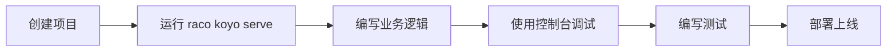

# 用 Koyo 构建 Web 应用：Racket 爱好者的现代开发工具箱

> 想用 Racket 写个正经的 Web 应用，光靠内置的 web-server 会觉得缺这缺那。Koyo 给你补齐了现代 Web 应用所需的一整套工具，而且想用什么用什么，不强制绑定。

你可能听说过 Racket——那门以优雅和表达能力著称的 Lisp 方言。但想用它写个 Web 应用？恐怕大多数人会觉得像是在用石斧造飞机。别担心，Koyo 来了。

## Koyo 是什么？

Koyo 是一个基于 Racket 的 Web 应用开发工具包。它不只是简单地包装了 Racket 内置的 web-server，而是提供了一个 **完整的开发生态系统**，包含了现代 Web 应用所需的一切功能。

最妙的是，Koyo 的所有组件都是 **解耦** 的。你想用什么就用什么，不想用的就丢掉——没有强制绑定的全家桶。

## 为什么选择 Koyo？

如果你的团队成员对 Racket 的理解仅限于 " 听说过 "，Koyo 的这几个特性会让你觉得相见恨晚：

### 1. 蓝图系统：秒速启动项目

别再纠结项目结构怎么搭了。运行一条命令，框架就帮你生成一个完整的项目骨架：

```bash
$ raco pkg install koyo
$ raco koyo new my-app # 或者 raco koyo new -b minimal my-app
$ cd my-app
```

Koyo 提供了三种蓝图模板（minimal、standard、saas），分别适合不同规模的项目。生成的项目结构清晰明了：

```text
my-app/ # 应用逻辑
my-app-tests/ # 测试
migrations/ # 数据库迁移
resources/ # 资源文件（翻译、样式、脚本等）
static/ # 编译后的静态文件
.env.default # 默认环境变量
Procfile # 进程配置（用于 chief）
package.json # 前端依赖
```

### 2. 交互式控制台：开发效率倍增器

Koyo 的杀手锏是其交互式 REPL：

```bash
$ raco koyo console
```

启动后，你可以通过简洁的语法访问应用的所有组件：

```racket
;; 使用 @ 符号快速访问组件
> @database
;; 或者
> (system-ref 'database)

;; 启动/停止系统
> (start)
> (stop)
```

这个控制台让你可以：
- 快速查询和修改数据库
- 测试各个组件的功能
- 实时调试问题
- 运行任意 Racket 代码

对于习惯了 Rails console 的开发者来说，这简直是如虎添翼。

### 3. 类型安全的配置系统

告别魔法字符串和配置地狱。Koyo 的配置系统基于环境变量，支持类型安全的选项定义：

```racket
;; 在 config.rkt 中定义配置
(define-option port "PORT" 8000) ; 默认端口 8000
(define-option database-url "DATABASE_URL" "postgres://localhost/db")
```

开发环境使用 `.env.default` 文件，生产环境通过 `raco koyo deploy -e` 命令传递环境变量，配置管理从未如此优雅。

## 开发工作流一览

Koyo 的开发流程简单直观：



你可以选择：
- **简单模式**：直接用 `raco koyo serve` 运行
- **专业模式**：使用 [chief](https://github.com/Bogdanp/racket-chief)（它会在后台自动编译前端资源并启动服务器）

## 核心架构：组件化设计

Koyo 的架构设计理念非常现代——**基于组件的架构**。每个功能模块（数据库、会话、任务队列等）都是独立的组件，通过依赖注入组合在一起。

这种设计带来的好处：
- **模块化**：每个组件职责单一，易于理解和维护
- **可测试性**：组件可以独立测试，也可以用 mock 替换
- **灵活性**：需要什么功能就引入什么组件，没有不必要的依赖

## 开箱即用的功能清单

Koyo 包含现代 Web 应用所需的所有标准功能：

- HTTP 服务器和中间件
- 数据库连接池和事务管理
- 会话管理和 CSRF 防护
- 任务队列和定时任务（Crontab）
- 静态文件服务
- 模板引擎（HAML）
- 邮件发送
- 日志系统
- 性能分析器
- 测试工具
- 部署工具

## 给 Racket 新手的建议

如果你之前没怎么用过 Racket，别担心。Koyo 的文档非常友好，建议按照这个学习路径循序渐进：

1. **快速开始**：创建第一个项目，了解基本结构
2. **项目结构**：熟悉蓝图系统和目录组织
3. **配置管理**：掌握环境变量的使用
4. **交互式控制台**：体验 REPL 的强大功能

当你习惯了 Racket 的括号和语法后，你会发现这种表达方式的优雅和强大。Koyo 只是帮你搭建了一个现代化的舞台，真正的精彩表演还得靠你自己。

## 总结

Koyo 不是试图用 Racket 复制一个 Rails 或 Django，而是提供了一个 **真正适合 Racket 哲学** 的 Web 开发工具箱。它尊重你的选择权，提供合理的默认值，同时不限制你的发挥空间。

如果你已经懂一些 Racket，或者只是想体验一下函数式编程在 Web 开发中的魅力，Koyo 值得一试。
